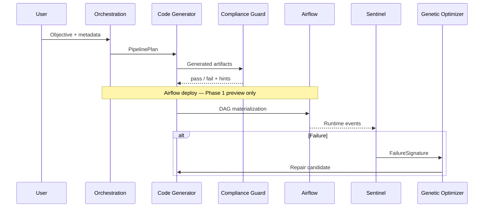

# ADES: Autonomous Data Engineering System

*Powered by Agentic AI*

[](https://opensource.org/licenses/MIT)
[](https://www.python.org/downloads/)

> **About this repository**  
> Open-core reference implementation of autonomous data engineering patterns—agentic orchestration, **Compliance-as-Code**, and self-healing pipelines for regulated, high-velocity workloads.

**Mental model:** ADES today is a **Python framework with a REST API** that generates pipeline artifacts from templates, validates them against YAML compliance rules, and exposes hooks for monitoring and repair. Full LLM orchestration and Airflow execution are on the [roadmap](ROADMAP.md) (Phase 2+).

---

## Overview

**Autonomous Data Engineering System (ADES)** is a modular framework for data pipelines in regulated environments. Specialized agents handle code generation, policy checks, runtime signals, and repair candidates—so teams can automate repeatable engineering work while keeping compliance visible in code.

Phase 1 delivers a **working vertical slice** (plan → generate → review). Later phases add LLM/RAG generation, Airflow deployment, and richer Sentinel analytics. See [LIMITATIONS.md](LIMITATIONS.md) for explicit boundaries.

## What works today (about 5 minutes)

```bash
git clone https://github.com/cleydsonborges/ades.git
cd ades && python -m venv .venv && source .venv/bin/activate
pip install -r requirements.txt && docker compose up -d
curl -s http://localhost:8000/health
```

Submit a plan (include audit fields for SOX/FISMA sample rules):

```bash
curl -s -X POST http://localhost:8000/plans \
  -H "Content-Type: application/json" \
  -d '{
    "objective": "CDC ingest with PHI mask",
    "metadata": {
      "template_id": "cdc_ingestion",
      "pii_columns": ["email"],
      "audit_trail": true,
      "lineage_id": "demo-1",
      "access_tier": "controlled"
    }
  }' | python -m json.tool
```

Example response (abbreviated):

```json
{
  "status": "pass",
  "revised": false,
  "report_id": "...",
  "artifact_hash": "...",
  "rules_evaluated": [{"rule_id": "hipaa.phi_masking", "passed": true, ...}],
  "artifacts": {"source_files": ["transform.sql", "ingest.py"], "tasks": ["ingest", "transform", "load"]}
}
```

Full tutorial: [docs/getting-started.md](docs/getting-started.md). Sector examples: [pilots/healthcare/objective.yaml](pilots/healthcare/objective.yaml), [pilots/banking/objective.yaml](pilots/banking/objective.yaml).

## Implementation Status

| Component | Status | Notes |
|-----------|--------|-------|
| Orchestration API (`POST /plans`, `/dags/preview`) | **Implemented** | Phase 1 happy path |
| Code Generator (template CDC) | **Implemented** | LLM/RAG planned Phase 2 |
| Compliance Guard (YAML rules) | **Implemented** | HIPAA, SOX, FISMA samples |
| Genetic Optimizer | **Implemented** | Minimal evolution + compliance fitness |
| Sentinel (`on_task_failure`, `ingest_telemetry`) | **Implemented** | Rule-based telemetry stubs |
| Predictive analytics | **Stub** | Champion/Challenger interface |
| Metadata lake (vector DB) | **Stub** | In-memory interface |
| Telemetry / KPI export | **Stub** | In-memory collector |
| Airflow in Docker Compose | **Planned** | See [docs/deployment.md](docs/deployment.md) |
| LangGraph / AutoGen supervisor | **Planned** | Phase 2 |

See [ROADMAP.md](ROADMAP.md) for phase definitions and delivery status.

## Key Pillars & Features

| Pillar | Capability (Phase 1) |
|--------|-------------------------|
| **Self-Healing ETL** | Template codegen + genetic optimizer repair loop (minimal) |
| **Sentinel** | Rule-based telemetry and failure signatures |
| **Compliance-as-Code** | YAML rule packs; `ComplianceGuardAgent.review()` gates deploy |

## Architecture Stack

| Layer | Technologies |
|-------|----------------|
| **Core Languages** | Python, PySpark, SQL |
| **Agentic Frameworks** | LangGraph, AutoGen (roadmap) |
| **Orchestration** | Apache Airflow (optional; roadmap) |
| **Infrastructure** | Docker, Kubernetes (deployment sketch) |

See [docs/architecture.md](docs/architecture.md) for diagrams and integration patterns.

## Repository Structure

```
ades/
├── .github/workflows/     # CI/CD (GitHub Actions)
├── docs/                  # Technical documentation
├── src/
│   ├── agents/            # code_generator, compliance_guard, sentinel, predictive
│   ├── core/              # genetic_optimizer, metadata_lake, telemetry, orchestration
│   └── pipelines/         # Pipeline templates
├── pilots/                # Sector pilot objectives (healthcare, banking)
├── tests/
├── LIMITATIONS.md         # Phase 1 boundaries
├── ROADMAP.md
├── CHANGELOG.md
└── LICENSE
```

## How It Works (Target Workflow)

The diagram below shows the **target** multi-agent flow. Phase 1 implements plan → generate → compliance via the API; Airflow and LLM steps are partial or planned.



1. **Plan** — `POST /plans` with objective and metadata.
2. **Write & Validate** — Code Generator + Compliance Guard (auto-revise on fail).
3. **Execute & Monitor** — DAG preview via `POST /dags/preview`; Sentinel + Genetic Optimizer for failures (library API today).

## Quick Start

### Prerequisites

- Python 3.11+
- Docker & Docker Compose

### Local development

```bash
git clone https://github.com/cleydsonborges/ades.git
cd ades
python -m venv .venv && source .venv/bin/activate
pip install -r requirements.txt
docker compose up -d
pytest tests/ -v
```

See [docs/deployment.md](docs/deployment.md) for deployment notes.

## Documentation

| Document | Description |
|----------|-------------|
| [Getting started](docs/getting-started.md) | Step-by-step Phase 1 tutorial |
| [For expert review](docs/for-expert-review.md) | Evidence map for third-party assessors |
| [Architecture](docs/architecture.md) | System design and delivery status |
| [Agents](docs/agents.md) | Agent modules (target + Phase 1 notes) |
| [Compliance](docs/compliance.md) | Policy-as-code (target + sample rules) |
| [Deployment](docs/deployment.md) | Docker and Airflow integration |
| [Limitations](LIMITATIONS.md) | What Phase 1 does not do |
| [Contributing](CONTRIBUTING.md) | Contribution guidelines |

## Testing

```bash
pytest tests/ -v --cov=src
```

CI runs lint, rule-pack validation, and tests on every push (`.github/workflows/ci.yml`).

## License

[MIT License](LICENSE)

## Contributing

See [CONTRIBUTING.md](CONTRIBUTING.md).

## Maintainer & attribution

**Cleydson Borges dos Santos** — principal architect and maintainer.

- **Provenance:** patterns consolidated from prior production work; see [commit history](https://github.com/cleydsonborges/ades/commits/main) and docstrings under `src/`.
- **Citation:** cite this repository and tag a release or commit SHA (see [CHANGELOG.md](CHANGELOG.md)).
- **Third-party review:** [docs/for-expert-review.md](docs/for-expert-review.md).
